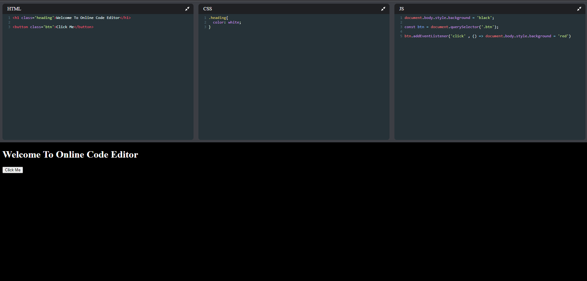

# Online Code Editor



## Overview

This is an online code editor built using React.js that allows you to write and run HTML, CSS, and JavaScript code in real-time. You can see the output of your code as you type, making it a useful tool for web developers and learners.

## Features

- Real-time code editing and preview.
- Support for HTML, CSS, and JavaScript.
- Syntax highlighting for a better coding experience.
- Responsive and user-friendly interface.

## How It Works

This online code editor is powered by two key libraries:

1. **CodeMirror:** CodeMirror is a versatile text editor for implementing code editing functionalities in web applications. It provides features like syntax highlighting, auto-indentation, and more.

2. **react-codemirror:** This library is a React wrapper for CodeMirror, allowing you to easily integrate CodeMirror into your React application. It simplifies the setup and usage of CodeMirror within a React component.

## Getting Started

To get started with this code editor, follow these steps:

1. Clone this repository to your local machine.

```bash
git clone https://github.com/your-username/online-code-editor.git


2. Navigate to the project directory:

```bash
cd online-code-editor
```

3. Install the required dependencies:

```bash
npm install
```

4. Start the development server:

```bash
npm start
```

5. Open your web browser and access the code editor at [http://localhost:3000](http://localhost:3000).

## Usage

- Choose a language (HTML, CSS, or JavaScript) using the tabs at the top.
- Start writing or pasting your code in the editor.
- You will see the output in real-time in the preview area.
- To save your code, you can create an account and log in.

## Contributing

We welcome contributions from the community. If you find a bug or have an idea for an improvement, please open an issue or submit a pull request. Make sure to follow the project's coding standards and guidelines.

## License

This project is licensed under the MIT License. See the [LICENSE](LICENSE) file for details.

## Contact

If you have any questions or need assistance, you can contact us at [your-email@example.com](mailto:your-email@example.com).

Happy coding!
```

Replace `"your-username"` with your actual GitHub username and update the email address and contact information accordingly. Also, make sure to include a screenshot (named "screenshot.png") of your code editor in the project directory.
